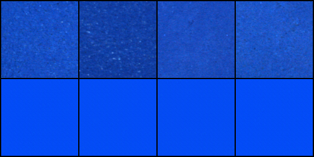
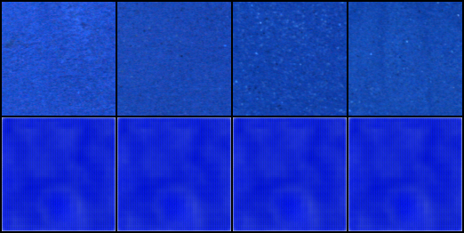
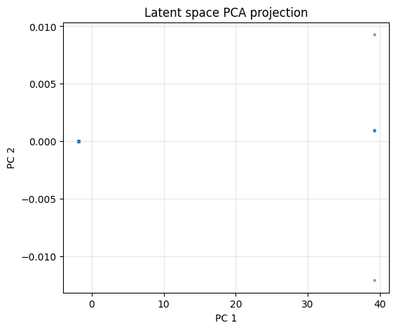
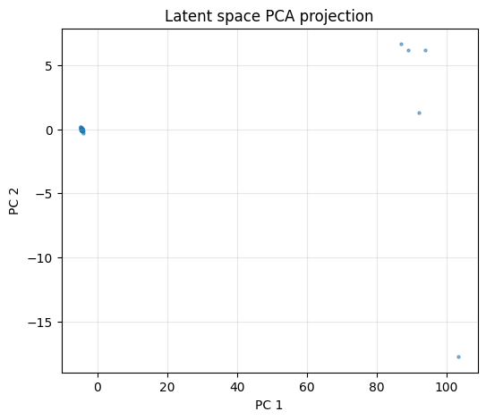

# FURI Soil Hyperspectral Reconstruction  
### Variational Autoencoders (Conv-VAE & Spatial ViT-VAE) for VNIR Soil Spectral Data  
**Researcher:** Prajakta Kadukar  
**Mentor:** Prof. Nakul Gopalan and Prof. Saurav Kumar 
**Program:** FURI — Fulton Undergraduate Research Initiative (Fall 2025)  
**Cluster:** ASU Sol HPC  

---

## Project Overview  
Hyperspectral soil imagery contains ~200 spectral bands per pixel and encodes rich information about mineralogy, soil composition, carbon content, and surface properties.  
However, these cubes are **high-dimensional**, expensive to store, and computationally heavy.

This project explores **Variational Autoencoders (VAEs)** — particularly a **Spatial Vision Transformer VAE** — to compress and reconstruct hyperspectral soil VNIR tiles:

- Input shape: **145 × 145 × 200**  
- VNIR2 dataset from `/scratch/mkhorram/Soil/VNIR2/`  
- Compression target:  
  - Conv-VAE → latent dim 1024  
  - Spatial ViT-VAE → latent map **16 × 16 × C**

The ViT-VAE significantly outperforms the baseline Conv-VAE.

---

## 📁 Repository Structure

furi-soil-hyperspectral-vae/
│
├── code/ # All training, evaluation, and model scripts
│ ├── hsi_dataset.py # Rasterio-based loader for .bip hyperspectral cubes
│ ├── train_vnir_vae.py # Main training script (Conv/VIT/Spatial-VIT)
│ ├── eval_vnir_vae.py # Evaluation: PSNR + SAM
│ ├── extract_latents.py # Extract latent vectors/maps
│ ├── visualize_latent_pca.py # PCA visualization of latents
│ ├── models/
│ │ ├── vae_conv.py # Baseline convolutional VAE
│ │ ├── vit_vae.py # Spatial transformer VAE
│ └── utils/metrics.py
│
├── jobs/ # SLURM job scripts for Sol HPC
│ ├── run_train.sbatch
│ ├── vnir2_conv_main.sbatch
│ ├── vnir2_vit_spatial_main.sbatch
│ └── vnir2_latents_main.sbatch
│
├── results/
│ ├── conv/ # Conv-VAE results
│ │ ├── eval_ep015.txt
│ │ ├── preview_ep015.png
│ │ └── latent_pca_ep025.png
│ └── vit_spatial/ # Spatial ViT-VAE results
│ ├── eval_ep025.txt
│ ├── preview_ep025.png
│ └── latent_pca_ep025.png
│
└── .gitignore

---

## Quantitative Results

### **Final Evaluation (on full VNIR2 dataset)**  
| Model | Latent Dim | PSNR ↑ | SAM ↓ |
|-------|------------|-------|--------|
| **Spatial ViT-VAE (ep025)** | 16×16×C (2048) | **24.68 dB** | **0.0628 rad** |
| **Conv-VAE (ep015)** | 1024 | 16.61 dB | 0.1713 rad |

**Result:** The Spatial ViT-VAE strongly outperforms the Conv-VAE in spectral/angular fidelity.

---

## Reconstruction Samples

### **Spatial ViT-VAE Reconstruction (ep025)**


### **Conv-VAE Reconstruction (ep015)**


---

## Latent Space PCA

### Spatial ViT-VAE Latents  


### Conv-VAE Latents  


---

## Training Instructions

### On ASU Sol HPC:
Activate environment:

```bash
source ~/venvs/furi310/bin/activate
cd /scratch/pkadukar/soil_proj

Train Spatial ViT-VAE

python -u code/train_vnir_vae.py \
  --model vit_spatial \
  --pattern "/scratch/mkhorram/Soil/VNIR2/*.bip" \
  --epochs 25 \
  --batch 8 \
  --lr 3e-4 \
  --beta 1e-3 \
  --amp \
  --latent 8 \
  --outdir "runs/vnir2_vit_spatial_main_metrics"

Evaluate

python -u code/eval_vnir_vae.py \
  --model vit_spatial \
  --ckpt runs/vnir2_vit_spatial_main_metrics/ep025.pt \
  --pattern "/scratch/mkhorram/Soil/VNIR2/*.bip" \
  --batch 16 \
  --latent 8 \
  --outdir runs/vnir2_vit_spatial_main_metrics/eval_ep025


